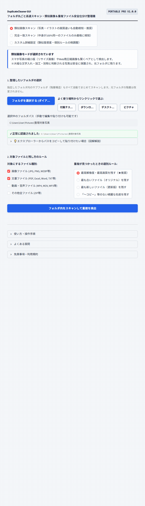

# 【Windows専用】DuplicateCleaner GUI ｜ 高速スキャン・類似画像＆重複ファイル安全仕分け整理機

> **「『誤って大切な写真を消してしまったらどうしよう…』その恐怖、もう不要です。」**  
> フォルダを指定して3秒。パソコン内の巨大な写真・素材フォルダを丸ごと高速スキャンし、中身が全く同じ重複ファイルや、リサイズ・画質違いの類似写真を自動で賢く検知。最高画質を元フォルダに残し、重複分を「_重複ファイル退避」フォルダへ安全に仕分け移動するWindows専用ポータブルGUIツールです。

## ■ 操作デモ（実際の動作）

---

## ■ こんな「パンパンに膨らんだフォルダ」、何年も放置していませんか？

- **スマホ写真や素材フォルダが重複ファイルで数十GBも圧迫されている**: 同じ写真を何度も保存してしまったり、別名で保存されたコピーや縮小版が散らばってストレージが足りない。
- **「どれがオリジナルの高画質か」を1枚ずつ見比べる苦痛**: 解像度やファイルサイズを目視で確認しながら手動で選別・削除する作業に追われ、途中で挫折する。
- **一般的な削除ソフトを使うのが怖い**: 自動削除を実行した結果、大切な家族写真や仕事の納品データまで消えて二度と戻らなくなるのが怖くて整理が進まない。
- **大切なプライベート写真や社外秘データをクラウドにアップできない**: 個人写真やクライアントの制作素材を海外のWebサーバーに送信することなく、PCローカル完結で安全に片付けたい。

写真家、デザイナー、クリエイター、そしてPCストレージ不足に悩むすべての方にとって、ファイルの整理は避けて通れない問題です。  
しかし、**「消してはいけない恐怖」に怯えながら、1枚ずつ手動で見比べる作業に何時間も費やす必要はありません。**

「DuplicateCleaner GUI」は、大切なデータを100%守りながらストレージを安全に解放するために開発された、完全実務特化型のポータブルソフトウェアです。

---

## ■ なぜ、他の方法ではなく「DuplicateCleaner」なのか？（4つの圧倒的理由）

### 1. 【最重要】いきなり消さない「_重複ファイル退避」フォルダへの安全移動設計
一般的な重複削除ソフトのように「いきなりゴミ箱行き」や「物理完全消去」は行いません。  
不要と判定された重複ファイルのみを、同じフォルダ内の **`_重複ファイル退避/` フォルダへ安全に移動** させます。  
元フォルダには残すと決めた最高品質の写真だけが綺麗に残り、万が一「やっぱり元に戻したい」と思った場合も、フォルダからドラッグ＆ドロップするだけで1秒で元通りに戻せる絶対的な安心設計です。

### 2. 人間の目線で縮小版を見抜く「知覚ハッシュ（dHash）エンジン」
人間の視覚特性に基づいた「知覚ハッシュ（dHash）」アルゴリズムを搭載。  
SNS用に縮小された画像や、Web用に少し画質を落とした画像も「同じ写真」として賢く検知します（※大幅な加工や文字入れをした写真は「別の写真」として安全に保護されます）。  
また、PDFやWordなどの文書ファイルは「完全一致（MD5）」で厳格に判定します。

### 3. 「一番綺麗な元画像」を自動で残すワンクリック選別ルール
重複が見つかったグループの中で、どれを元フォルダに残すかをワンクリックで自動選択：
- **最高解像度・最高画質優先（推奨・初期設定）**: 一番大きく綺麗なオリジナル写真を残し、縮小コピーを退避
- **最古（元祖）優先**: 最初に撮影・保存された元祖ファイルを残す
- **最新（更新版）優先**: 直近で編集を加えた最新ファイルを残す

### 4. 巨大フォルダも一瞬！「直接スキャン＆完全オフライン」
数千枚・数十GBの巨大な写真フォルダも、フォルダパスを指定するだけで直接高速スキャン。  
ブラウザへの重いアップロードや巨大ZIPの作成は一切行いません。完全オフライン動作のため、プライベート写真や社外秘データが外部に送信される心配もゼロです。

---

## ■ 作業時間は「数時間」から「3秒」へ（使い方3ステップ）

1. **起動する**: フォルダ内の `DuplicateCleaner.vbs` をダブルクリックします。
2. **選ぶ**: 整理したい写真フォルダを指定し、**「フォルダ内をスキャンして重複を検出」** をクリック。
3. **確認して退避**: スキャン結果とサムネイルを確認し、**「不要な重複ファイルを退避フォルダへ移動」** をクリック！
   - 元フォルダがスッキリ片付き、ギガ単位の空き容量が一瞬で復活します。
   - Excelで見られるスキャン結果レポートCSVも保存可能です。

---

## ■ 動作環境・仕様

- **対応OS**: Windows 10 / 11 (64-bit)
- **インストール**: 不要（完全スタンドアロン動作・Embedded Python同梱）
- **対応画像形式**: JPG, PNG, WEBP, BMP, TIFF等
- **対応文書・その他形式**: PDF, Word, Excel, MP4等（完全一致判定）
- **安全設計**: 完全オフライン動作・非破壊退避移動方式

---

## 🛒 ダウンロード・ご購入のご案内（BOOTH公式ストア）

まずは使い勝手をお手元のPCでお試しいただけるよう、無料Lite版と全機能対応の製品版をご用意しております。

👉 **[BOOTHでダウンロード・購入する](https://nichesoftmakers.booth.pm/items/8809405)**  
- **無料Lite版**: 0円（まずは基本機能や快適な操作感をお試しいただけます）
- **製品版**: **3,980円**（追加課金なしの買い切り・全機能無制限）

動画編集・音声処理・事務自動化など、全ツールの製品版やおトクな業務別バンドルパックも公式BOOTHストアにて公開中です。

---

## 💡 【ご購入・ご利用前に必ずご確認ください】初回起動時のWindows保護画面について

本ソフトは、パソコンのレジストリを変更せず解凍するだけで手軽に使える「ポータブル仕様（インストール不要）」として提供されているため、初回起動時にWindowsの画面に「**WindowsによってPCが保護されました**」という青い確認画面（SmartScreen）が表示される場合があります。

これは、パソコンのレジストリを変更せず手軽に使える未署名のツールに対して、**Windowsが形式上必ず表示する標準的な安全確認画面**です。  
ウイルス等の不正プログラムは一切含まれておらず、インターネット通信も行わない「完全ローカル・安全設計」となっております。

**【解除・起動手順（2クリックで完了します）】**
1. 画面内の **「詳細情報」** をクリックします。
2. 右下に現れる **「実行」** ボタンをクリックします。  
※一度実行すれば、次回以降はこの画面は表示されずスムーズに起動します。

---

## 📄 免責事項・利用規約（ライセンス区分）

- **個人利用を想定**: 本ソフトウェアは個人クリエイター・個人事業主等のPC業務効率化を目的として開発された個人利用専用ツールです。
- **シングルユーザー許諾**: ご購入者様本人（1名）のみ利用可能（ご自身が専属で使用する複数台PCでの利用は許可されます）。組織内での共有・複数名での共同利用・社内共有には対応しておりません。
- 本ソフトウェアは現状有姿（As-Is）で提供され、技術サポート・個別動作保証は行われません。詳細は同梱の `README.txt` をご確認ください。

---

## 📮 不具合報告・改善要望目安箱

本ツールに関する不具合の報告や「こんな機能が欲しい」というご要望は、以下の専用目安箱フォームよりお気軽にお寄せください（完全匿名・返信なし）：  
👉 **[ご意見・不具合報告フォーム ](https://forms.gle/2ib5A8EuhpaRs8QSA)**  
※原則として個別サポート・返信は行っておりませんが、いただいた内容はすべて開発者が目を通し、今後の機能改善やアップデートの参考とさせていただきます。
